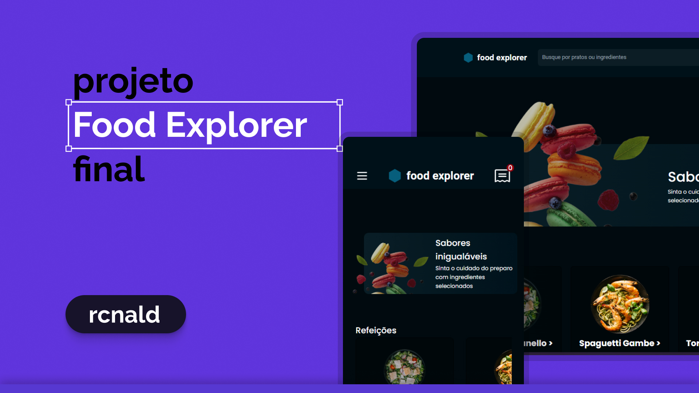

# Food Explorer Front-End

Projeto final da trilha Explorer da Rocketseat, que tem como objetivo colocar em pratica todos os conhecimentos adquiridos ao longo do treinamento. 

Food Explorer é uma plataforma de que simula um catalogo digital de restaurante, onde oferece ao usuário a diversos tipos de bebidas e pratos, com informações adicionais, como nome e descrição do prato, seus ingredients, fotos e preço, dando uma sensação de mais controle/segurança ao cliente.



## Funcionalidades

- **Pesquisa:** Pesquisar pratos por nome ou ingredientes usados em sua preparação.
- **Visualização detalhada:** Ao clicar sobre qualquer prato, será exibido detalhes sobre sua composição.
- **Criação de pratos(administrador):** Crie pratos com foto de exibição, nome , descrição categoria...
- **Edição de pratos(administrador):** Faça modificações a um prato ja existente em seu catalogo.
- **Exclusão de pratos(administrador):** Apague um prato de seu catalogo, sem muitas dificuldades.

## Conta demonstração
```http
e-mail: admin@admin.com
senha: adminadmin
```

## Pré-requisitos

Antes de começar, certifique-se de ter o [Node.js](https://nodejs.org/) instalado em seu sistema.

## Como Usar

1. **Clone este repositório:**
   ```bash
   git clone https://github.com/rcnald/food-explorer-frontend.git
   # or
   gh repo clone rcnald/food-explorer-frontend
   ```
2. **Entrar no diretório**
    ```bash
    cd food-explorer-frontend
    ```
  
3. **Instalar suas dependências**
   
    ```
    npm install
    ```
4. **Crie e configure o arquivo de configuração**

    Crie um arquivo `.env` na raiz do projeto, com base no `.env.example`

    ```ts
    VITE_BASE_URL=api_url
    ```
5. **Iniciar o projeto**
    ```
    npm run dev
    ```
    Logo após isso o projeto será iniciado na porta [http://localhost:5173](http://localhost:5173) se disponível.

## Tecnologias usadas
Tecnologias e bibliotecas utilizadas para a construção do projeto. 
- [react](https://react.dev/)
- [react-router-dom](https://reactrouter.com/en/main)
- [typescript](https://www.typescriptlang.org/)
- [axios](https://axios-http.com/docs/intro)
- [react-icons](https://react-icons.github.io/react-icons/)
- [styled-components](https://styled-components.com/)
- [vite](https://vitejs.dev/guide/env-and-mode)
- [jwt](https://jwt.io/)